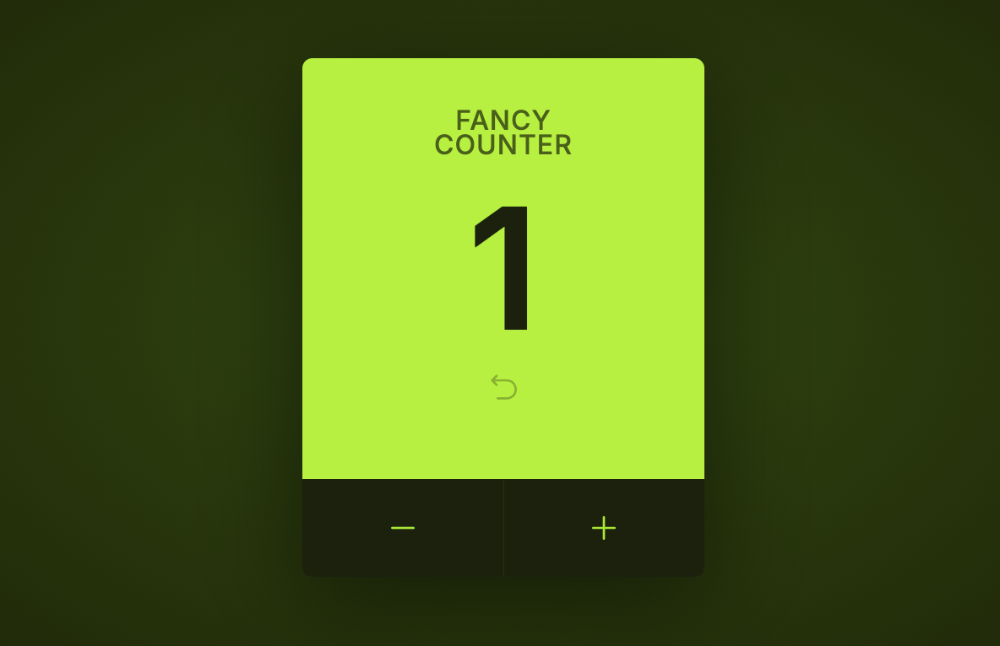

# Counter App

A simple and interactive counter application built with [Vite](https://vitejs.dev/) and [React](https://reactjs.org/). The app allows users to increment or decrement a counter, set a threshold after which the counting is deactivated, and reset the counter at any time.

## Table of Contents

- [Features](#features)
- [Demo](#demo)

## Features

- **Increment/Decrement:** Users can increase or decrease the counter-value.
- **Threshold Limit:** The counter stops when a user-specified limit is reached.
- **Reset Button:** Resets the counter to its initial value.
- **Responsive UI:** Simple and clean interface, optimized for all screen sizes.

## Demo

A live demo of the application is available at: [Your Demo Link Here](http://fancy-counter-ten.vercel.app)

 <!-- Add a screenshot of the app here -->

